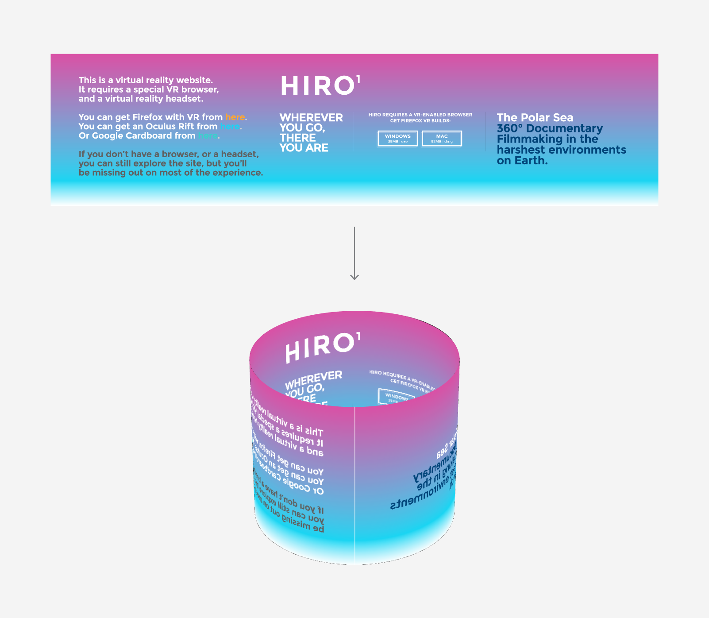
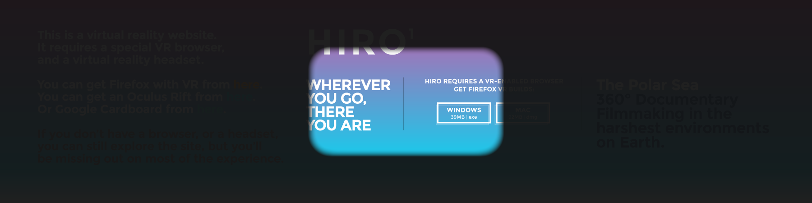

After years of bouncing between Photoshop and Keynote I've happily settled on Illustrator as my primary interface design tool. I'm good with 3D apps like Cinema4D, but for all their power, they're painful to use for typography, interface layout, etc. So when it came time to design a VR web navigation UI, I wanted a workflow that let me rapidly iterate from mockups created in Illustrator to wrap-around web VR test scenes.

<div class="post-summary">
  <h2>In Brief</h2>
  <ol>
    <li>Create your layout in a 2D design app and export as a bitmap.</li>
    <li>Create cylinder mesh in Three.js with a circumference/height ratio that matches the width/height ratio of the bitmap.</li>
    <li>Apply the bitmap as a texture to the cylinder and flip the cylinder faces.</li>
    <li>View in VR!</li>
  </ol>
  <a href="" class="post-assets">
    
    View Demo</a>
  <a href="" class="post-assets">Get Source</a>
</div>

We start in our preferred 2D design app. In my case, Illustrator. We create a canvas that is **360cm x 90cm**. When later viewed in the Rift, this canvas will wrap around us, mapped onto a cylinder which we (or the WebGL camera, more accurately) are in the center of. Like the following:

<figure>
  
  <figcaption>
    Our 360x90cm Illustrator layout will be mapped onto a WebGL cylinder with a 360cm circumference and 90cm height.
  </figcaption>
</figure>

Working with real world units is important because sense of scale is integral to virtual reality, and the scale your users will perceive will be determined primarily by size of the elements in your scene relative to the distance between the user's eyes. A distance which is defined in real world measurements (meters, to be precise). Working in real world units throughout our pipeline ensures we don't encounter any weird surprises, like text blocks that suddenly appear 10 stories tall (unless of course you _want_ that). <!--That measurement is the refered as the interpupilary distance, and it is 60mm on average in adults. The Rift reports this to the browser as 0.064 meters. by the . A VR HMD is displaying a different image to each eye,  rendering of virtual reality creates the perception of genuine scale. Your eyes can perceive the difference between a virtual cup a table versus a mountain miles away.-->

As we create our layouts, it's also important that we know where on the cylinder our elements will eventually appear. That's why a 360cm width is convenient: each centimeter on the horizontal of our composition will equal one degree on the circumference of the 3D cylinder. The center of our layout (180cm/180°) will appear directly in front of the viewer, while the left and right edges will appear behind them.

<figure>
  
</figure>

But wait! How much of our layout will be visible to the user? Human field of view is [limited](http://xkcd.com/1080/), after all. We wouldn't want to make our users turn their heads 90° to read an important status indicator. The following diagram from Extron gives us some idea of what we have to work with.

<figure>
  
  <figcaption>
    Human field of vision is approximately 180° horizontal, but our ability to read text is limited to just the center 10°, and our ability to perceive symbols to the center 60°.
  </figcaption>
</figure>

To help us keep track of what our users can see, it's helpful to set up a few guides in our layout template that express these values. Most importantly, the center 60°, 30° and 10° of our vision, within which we can see color, shape and text, respectively.

<figure>
  
</figure>

We also need to remember that current VR headsets have a fairly limited field of view. The DK2, for example, has an effective horizontal field of view of approximately 90°. This crops what we can see in the headset (without turning our heads) to the following:

<figure>
  
</figure>

Once we have a layout ready, we want to export it as a bitmap. We can scale at export-time as much as we need, so long as we do not change the same layout's width/height ratio. 

## Viewing our layout in VR

The good news is we don't need much JS to create our WebGL VR scene. The following scene is built on the MozVR Three.js web VR boilerplate, available from our [vr-web-examples repo](https://github.com/MozVR/vr-web-examples). It uses [Three.js](https://github.com/mrdoob/three.js) and two extra libraries that handle detecting, communicating and rendering to an attached VR headset.

To preview our mockup, we simply copy the bitmap we saved into the `/images` directory and rename it `mockup.png`, overwriting the existing file. We then load `index.html` into our VR-enabled browser (like [Firefox with VR](http://mozvr.com/downloads)), and enter VR mode by pressing `F` or double-clicking. In our headset the scene the browser should render our scene, and we should see our layout wrapped around us on a cylinder.

### The code

Let's look at `index.html` to see how this works. Most of the code is standard boilerplate for a Three.js scene with VR support. To add our layouts, we need to: 

1. Create a cylinder geometry with a circumference/height ratio that matches the width/height ratio of the bitmap.
1. Create a material and load our mockup as a texture
1. Flip the cylinder geometry to ensure the mockup displays correctly (facing "inwards")
1. Create a mesh from our geometry and material and add it to the scene so it renders.

To do this we first set up a few variables for our cylinder geometry:

```javascript
/*
Set up the key measurements of the cylinder that will display our mockup image. It is important to match these measurements to the size of the image, or the surface area of the cylinder will be different from the image, causing it to appear squished or stretched. We start with the circumference of the cylinder. Set it to match the width of the image. Remember that the standard unit of measurement for VR scenes is meters. If our mockup canvas is 360 centimeters wide, for example, we set the circumference value to be 3.6 (360/100).
*/

var circumference = 3.6;

/*
Set up the radius of the cylinder. We derive the radius from the circumference.
*/

var radius = circumference / 3.14 / 2;

/*
Set up the height of the cylinder. As with the circumference, we match this value to the height of our mockup, and convert to meters (from 90cm to 0.9 meters)
*/

var height = 0.9;

```

We then create a cylinder geometry instance using the variables, and invert it's faces:

```javascript
/*
Create the geometry for the cylinder object that will display our mockups.
The cylinder constructor takes the following arguments: CylinderGeometry(radiusTop, radiusBottom, height, radiusSegments, heightSegments, openEnded). We add 60 radiusSegments to make the cylinder smooth, and leave the top and bottom openEnded.
*/

var geometry = new THREE.CylinderGeometry( radius, radius, height, 60, 1, true );

/*
Invert the scale of the geometry on the X axis. This flips the faces of the cylinder so they faces inwards, which has the visible effect of displaying the mockups as we expect: facing inwards and in the correct orientation. Try removing this line to see what happens without flipping the scale.
*/

geometry.applyMatrix( new THREE.Matrix4().makeScale( -1, 1, 1 ) );

```

We then create a material for our mesh:

```javascript
/*
Create the material that we will load our mockup into and apply to our cylinder object. We set `transparent` to true, enabling us to optionally use mockups with alpha channels. We set `side` to THREE.DoubleSide, so our material renders facing both inwards and outwards (relative to the  direction of the faces of the cylinder object). By default, materials and the faces of Three.js meshes face outwards and are invisible from the reverse. Setting THREE.DoubleSide ensures the cylinder and it's material will be visibile no matter which direction (inside or out) we are viewing it from. This step is not strictly necessary, since we are actually going to invert the faces of the object to face inwards in a later step, but it is good to be aware of the `side` material attribute and how to define it. We then load our mockup as a texture.
*/

var material = new THREE.MeshBasicMaterial( { 
  transparent: true, 
  side: THREE.DoubleSide,
  map: THREE.ImageUtils.loadTexture( 'images/mockup.png' )
});
```

Next, we create the mesh and add it to our scene:

```javascript
/*
Create the mesh of our cylinder object from the geometry and material.
*/

var mesh = new THREE.Mesh( geometry, material );

/*
Add our cylinder object to the scene. The default position of elements added to a Three.js scene is 0,0,0, which is also the default position of our scene's camera. So our camera sits inside our cylinder.
*/

scene.add( mesh );
```

0ur cylinder should now render in the scene, with us positioned at it's center.

## Experimenting further

With our layout loaded, there's lots more we can optionally do.

### 1. Change the radius of our cylinder

This has the effect of bringing the mockup closer or further from the user. By default, a cylinder with a circumference of 3.6m has a radius of 0.573 meters (22.5 inches). This is about the average distance that most of us view our desktop or laptop displays from. Using your VR headset, you can adjust the mesh scale to see what feels right for your layout. Make sure to set the same value for the X,Y and Z, or the cylinder will be stretched.

```javascript
/*
To adjust the distance between our mockups and the user, we can optionally scale our mesh. If we apply 0.5 to the X,Y,Z, for example, the radius shrinks by half, and the mockups become twice as close to our eyes. Because we are scaling proportionally (equal on X,Y,Z) the mockups do not _appear_ any larger, but the stereo effect of the VR headset tells us they are closer. Play with this setting to find a value that you like.
*/

mesh.scale.set( 0.5, 0.5, 0.5 );
```

As you experiment, also consider the potential for other objects in your scene to come between your layout and the user. If I design a heads up display-style navigation interface with a 0.5 meter radius, for example, and my avatar in the VR world walks up to a wall, the geometry of the wall is probably going to come closer than the interface, thereby occluding it. My loading indicator suddenly disappearing into brick.

The [Oculus Best Practices Guide](http://static.oculus.com/sdk-downloads/documents/Oculus_Best_Practices_Guide.pdf) (which is required reading for any creator of VR content) suggests the following:

> "Bringing UIs in closer (eg 20cm) can help prevent occlusion (where in-world objects come closer to the user than HUD objects), but require the user to "...shift their focus between the close-up HUD and the much more distant scene whenever they check the HUD. These kinds of shifts in eye convergence and accomm odation (eye lens focus) can quickly lead to fatigue and eyestrain."

### 2. Add a background image

By default the background of our scene is black, but it's easy to add a background image.

```javascript
/*
To optionally add a background image to the scene, create a large sphere and apply a bitmap to it. First, create the geometry for the sphere. The SphereGeometry constructor takes several arguments, but we only need the basic three: radius, widthSegments, and heightSegments. We set radius to a big 5000 meters so the sphere is less likely to occlude other objects in our scene. We set width and height segments to 64 and 32 respectively to make it sphere surface smooth. And we then invert the geometry on the x-axis using THREE.Matrix4().makeScale(), to flip the geometry faces so they face "inwards", as we did with the mockup cylinder.
*/

var geometry = new THREE.SphereGeometry( 5000, 64, 32 );
geometry.applyMatrix( new THREE.Matrix4().makeScale( -1, 1, 1 ) );

/*
Create the material we will load our background image into.
*/

var material = new THREE.MeshBasicMaterial( {
  map: THREE.ImageUtils.loadTexture( 'images/background.png' )
} );

/*
Create the mesh of our background from the geometry and material, and add it to the scene.
*/

var mesh = new THREE.Mesh( geometry, material );
scene.add( mesh );

```

And that's it! When we load the scene and put on our headset, we should by standing inside our mockup layout, with a distant background image wrapping everything.

Play around with different background images to find one that gives you the constrast you want. I tend to use something that approximates the look of my final 3D scene, so I can judge colors, legibility, etc. For best results use panoramic images in equirectangular format, like the following. They will map perfectly (without distortion) to the WebGL sphere:

<figure>
  
  <figcaption>
    An example of an equirectangular image, taken by Alexandre Duret-Lutz. Find more of Alexandre's beautiful panos on <a href="https://www.flickr.com/photos/gadl/" target="_blank">Flickr</a>.
  </figcaption>
</figure>

Flickr's [Equirectangular Pool](https://www.flickr.com/groups/equirectangular/) is a fantastic source for images (just be sure to check the licenses). You can also use 3D apps to render 3D scenes into equirectangular format. I used Cinema4D + Vray to create the blurred pano used in this tutorial, for example. Or if need just a simple gradient or solud color, use your favorite image editing app to fill a canvas with 2:1 width:height proportions.


### 3. Create multiple layers at different depths

Depth is a fundamental element of design for virtual reality. Through the two separate eyes of a VR headset we can perceive even slight differences in z-position between elements. We can see  a glowing button is hovering 0.5cm above the surface of it's parent dialothatgue, for example, or that a UI stretches off into the horizon. Depth in VR does naturally what drop shadows do skeumorphically in 2D layouts: create visual contrast between stacked layers.

Adding additional layers to our scene is easy. We create additional meshes and load a different bitmaps into their materials.

* Copy and paste the code above, not including the variables for circumference, radius, and height (they only need to be specified once).
* In the new material, specify a different bitmap, eg `THREE.ImageUtils.loadTexture( 'images/mockup-background.png' )`
* Tweak the mesh scale values to push the layout closer or further, as desired. This creates separation between layers.

My tactic in creating the Mozvr.com layout was to start by building my layouts in a single Illustrator layer without thinking too much about 3D composition, and then group the elements into new layers towards the end of the process, with each layer representing a different depth. I then saved each layer individually as a bitmap with transparency. Each of these I then loaded into it's own cylinder mesh, which I then tweaked the scale of to find the desired separations. I found quickly that Depth is particularly spectacular when combined with the DK2's 3D camera, which enables us to instantly perceive the parallax effect between layers as we lean our bodies around inside the virtual world.

## Have fun!

This technique enables us to bridge the workflows we know with the new world of virtual reality. It's a quick a simple way to iterate rapidly. Start hacking and have fun!

<!--## TODO

* Add screenshots of progress and result to code section
* Create assets download section
  - Firefox with VR
  - Illustrator template (save as Illustrator 8 to ensure accessibility)
  - Three.js & VR libs (latest)
  - Code (final scene)
* Create GIF of user leaning in to HIRO, showing depth effect
* Link to end result (open in VR mode)
-->

